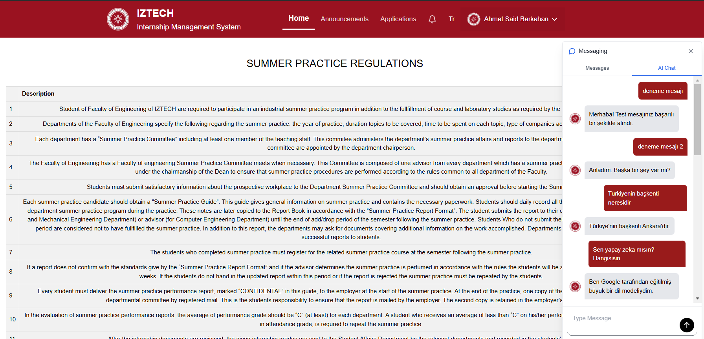
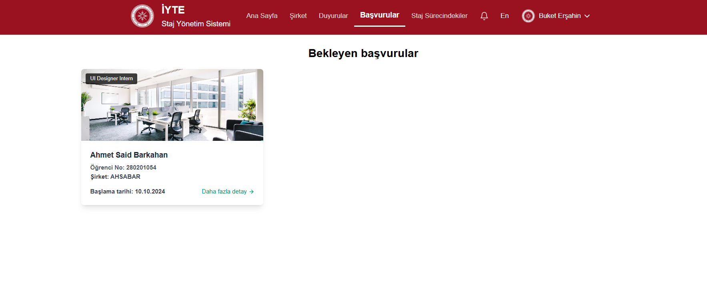
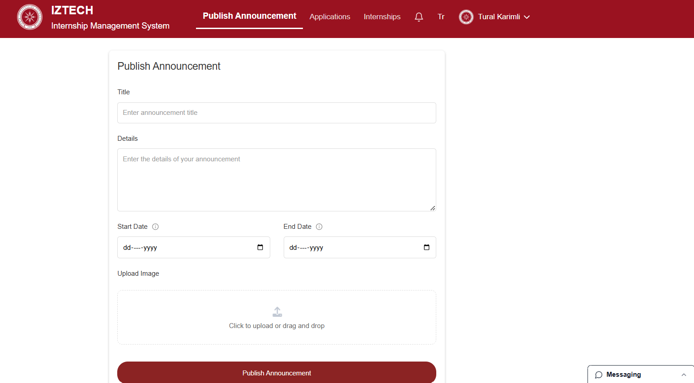
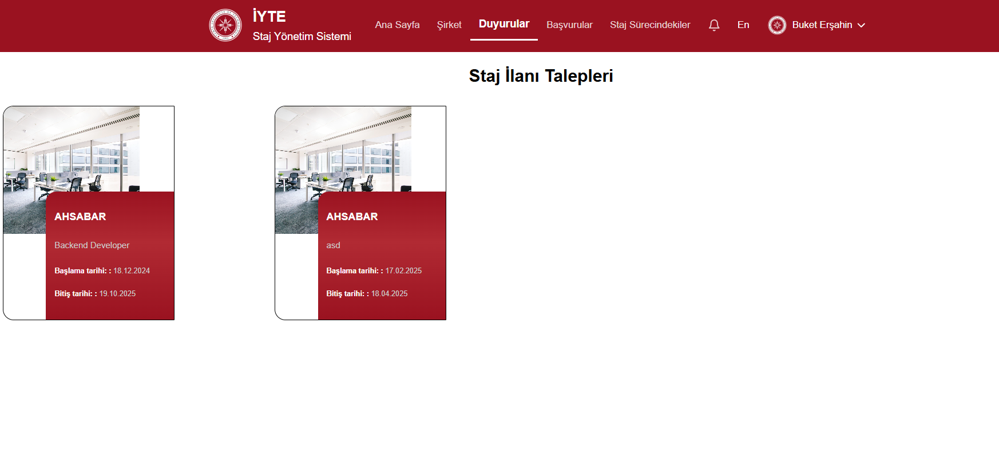
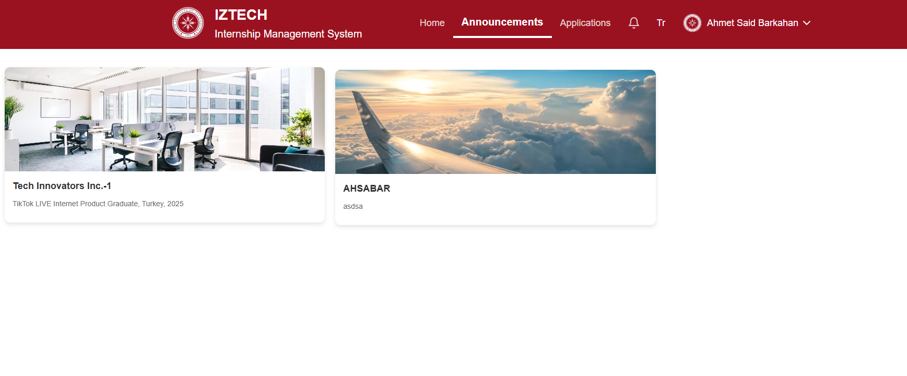
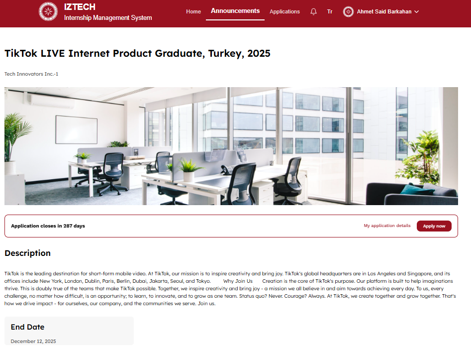
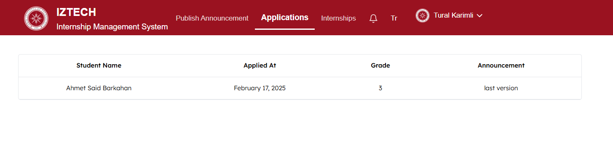
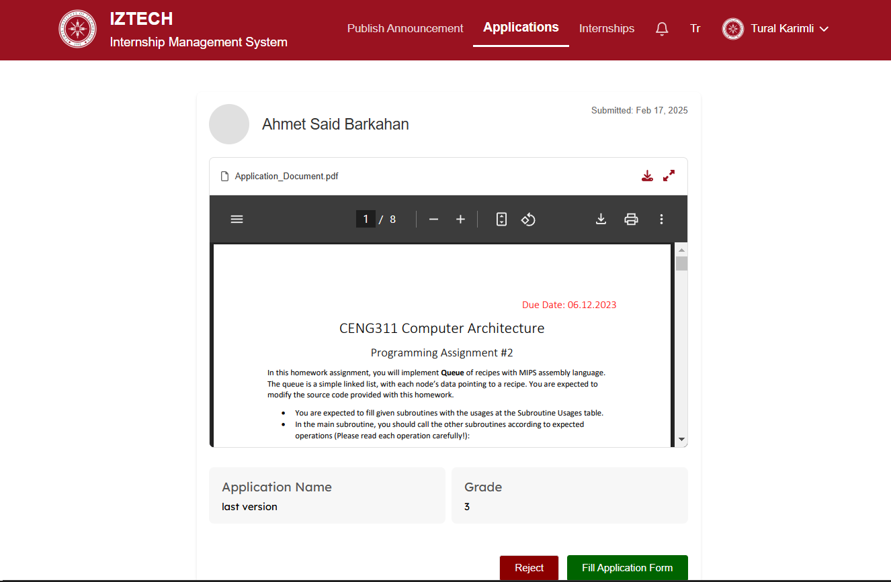
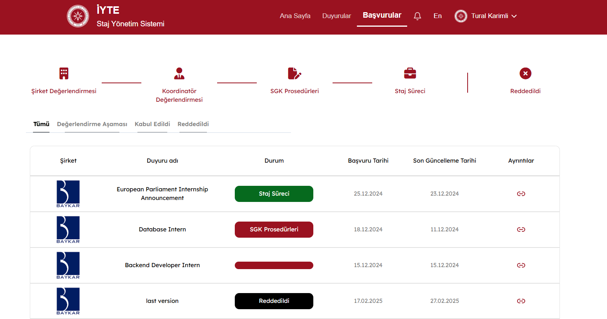

Automated Internship System

The Automated Internship System is a web-based platform designed to streamline and automate
the internship process within the IZTECH Computer Engineering Department. This system aims 
to improve efficiency by digitizing manual processes, ensuring compliance with regulations,
and facilitating communication between students, companies, and department staff.

Some frontend pages where this API is used:

student-> home page with AI chatbot
  

Admin-> company registration request page:
  

company-> publish announcement page
  

Admin-> announcement requests page:
 

student-> announcements page
  

student-> specific announcement page
  

company-> applications page
  

company-> student's application page

student-> internship applications states
 

